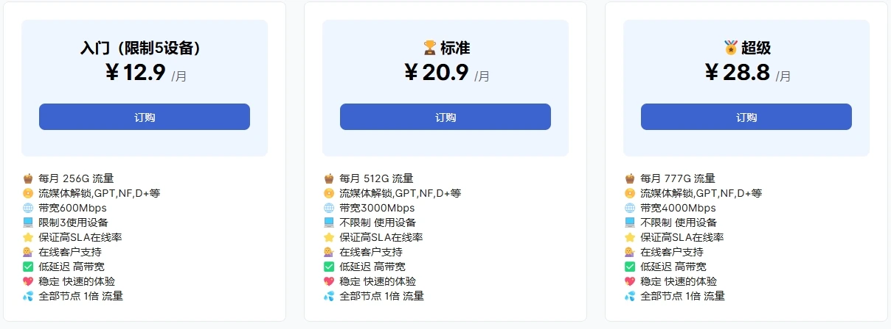

# 黑海云 - *多入口中转的稳定高速 VPN 推荐*

**黑海云机场**（Tblack Cloud）是 2022 年上线的翻墙机场服务，提供联通、电信、移动以及腾讯云的多入口中转节点，适合国内用户高速访问国际网络。

## 黑海云机场的特点

- 全节点 **1 倍率**，无隐藏倍率  
- 支持解锁 Netflix、Disney+、YouTube Premium、ChatGPT  
- 多地区节点覆盖，包括香港、日本、新加坡、美国等  
- 兼容 Clash、Shadowrocket、Quantumult X、Stash、sing-box 等主流工具  
- 支持微信、支付宝付款  

## 套餐价格一览

| 套餐 | 月费 | 流量 | 带宽 | 设备限制 |
|------|------|------|------|-----------|
| 入门 | **¥12.9** | **256GB/月** | 600 Mbps | 最多 5 台 |
| 标准 | ¥20.9 | 512GB/月 | 3000 Mbps | 不限设备 |
| 超级 | ¥28.8 | 777GB/月 | 4000 Mbps | 不限设备 |

## 节点分布与测速情况

**常用地区：** 香港、日本、新加坡、美国、台湾、韩国  
**冷门节点：** 俄罗斯、印度、土耳其、英国、德国、菲律宾等  

最新测速结果显示，新加坡和日本节点速度优秀，适合日常主力使用。

## 使用须知

- 禁止账户共享，违反将封号且不退款  
- 严禁从事爬虫、攻击、政治相关等非法行为  
- 购买前请确认服务是否适用，非质量问题不提供退款  

## 总结

黑海云机场适合寻求稳定、全平台兼容、支持流媒体的用户。其套餐灵活、节点分布广泛，是当前性价比较高的科学上网选择之一。

> **黑海云** - 多入口中转的稳定高速 VPN 推荐：访问 [官网](https://jump.p6p.net/312) 订阅。
